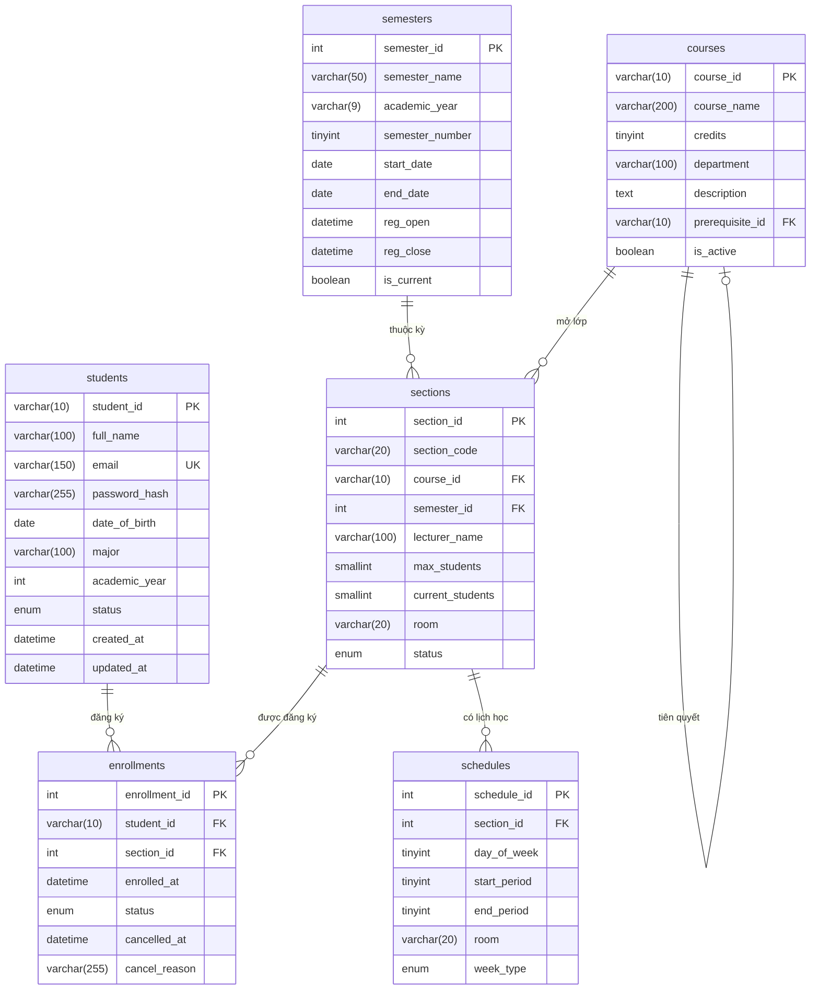
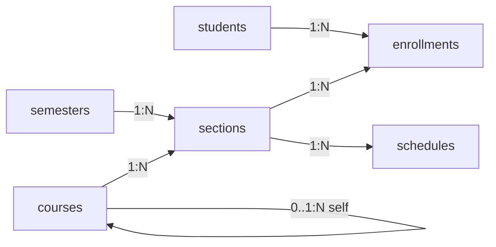
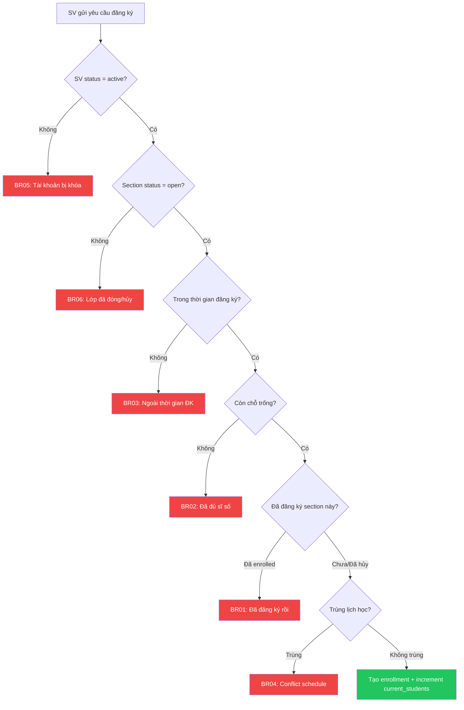

#  Tài Liệu Database - Web Quản Lý & Đăng Ký Học Phần

**Phiên bản:** 1.0  
**Cập nhật:** 23/03/2026  
**Database Engine:** MySQL 8.0+ / MariaDB 10.6+  
**Charset:** `utf8mb4` | **Collation:** `utf8mb4_unicode_ci`

---

##  Mục Lục

1. [Tổng quan](#1-tổng-quan)
2. [Sơ đồ ERD](#2-sơ-đồ-erd)
3. [Chi tiết từng bảng](#3-chi-tiết-từng-bảng)
4. [Quan hệ & Foreign Keys](#4-quan-hệ--foreign-keys)
5. [Indexes](#5-indexes)
6. [Business Rules & Constraints](#6-business-rules--constraints)
7. [Hướng dẫn Migration](#7-hướng-dẫn-migration)
8. [Dữ liệu mẫu](#8-dữ-liệu-mẫu)

---

## 1. Tổng quan

Hệ thống sử dụng **6 bảng** trong cơ sở dữ liệu quan hệ:

| # | Bảng | Mô tả | Số cột |
|---|------|--------|--------|
| 1 | `students` | Thông tin sinh viên / tài khoản đăng nhập | 10 |
| 2 | `courses` | Danh mục môn học trong chương trình đào tạo | 7 |
| 3 | `semesters` | Quản lý học kỳ theo năm học | 9 |
| 4 | `sections` | Lớp học phần (mở theo từng học kỳ) | 9 |
| 5 | `schedules` | Thời khóa biểu chi tiết từng lớp học phần | 7 |
| 6 | `enrollments` | Đăng ký học phần (quan hệ N-N: student ↔ section) | 7 |

---

## 2. Sơ đồ ERD



---

## 3. Chi tiết từng bảng

### 3.1 `students` — Thông tin sinh viên

Lưu trữ tài khoản và hồ sơ sinh viên. Mỗi sinh viên đăng nhập bằng **email** và **mật khẩu** (hash bcrypt).

| Cột | Kiểu | Khóa | NULL | Default | Mô tả |
|-----|------|------|------|---------|-------|
| `student_id` | `VARCHAR(10)` | **PK** | NO | — | Mã SV (VD: `21IT001`) |
| `full_name` | `VARCHAR(100)` | | NO | — | Họ và tên đầy đủ |
| `email` | `VARCHAR(150)` | **UQ** | NO | — | Email đăng nhập |
| `password_hash` | `VARCHAR(255)` | | NO | — | Mật khẩu hash (bcrypt, salt=10) |
| `date_of_birth` | `DATE` | | YES | `NULL` | Ngày sinh |
| `major` | `VARCHAR(100)` | | YES | `NULL` | Ngành học |
| `academic_year` | `INT` | | YES | `NULL` | Năm nhập học (2000-2100) |
| `status` | `ENUM('active','suspended','graduated')` | | NO | `'active'` | Trạng thái tài khoản |
| `created_at` | `DATETIME` | | NO | `CURRENT_TIMESTAMP` | Thời gian tạo |
| `updated_at` | `DATETIME` | | NO | `CURRENT_TIMESTAMP` | Thời gian cập nhật |

>  **Lưu ý bảo mật:** Không bao giờ lưu mật khẩu dạng plain text. Sử dụng `bcrypt` với `salt rounds = 10`. Email phải có UNIQUE constraint ở cấp DB.

---

### 3.2 `courses` — Danh mục môn học

Thông tin tĩnh về các môn học trong chương trình đào tạo. Hỗ trợ **tự tham chiếu** (self-referencing FK) cho môn tiên quyết.

| Cột | Kiểu | Khóa | NULL | Default | Mô tả |
|-----|------|------|------|---------|-------|
| `course_id` | `VARCHAR(10)` | **PK** | NO | — | Mã môn (VD: `IT3001`) |
| `course_name` | `VARCHAR(200)` | | NO | — | Tên môn học |
| `credits` | `TINYINT` | | NO | — | Số tín chỉ (1–10) |
| `department` | `VARCHAR(100)` | | YES | `NULL` | Khoa/Bộ môn |
| `description` | `TEXT` | | YES | `NULL` | Mô tả chi tiết |
| `prerequisite_id` | `VARCHAR(10)` | **FK** | YES | `NULL` | Môn tiên quyết → `courses(course_id)` |
| `is_active` | `BOOLEAN` | | NO | `TRUE` | Môn đang hoạt động |

>  `prerequisite_id` là **self-referencing FK**. Khi query, cần JOIN bảng `courses` với chính nó để lấy tên môn tiên quyết.

**Ví dụ query môn tiên quyết:**
```sql
SELECT
    c.course_id,
    c.course_name,
    p.course_name AS prerequisite_name
FROM courses c
LEFT JOIN courses p ON c.prerequisite_id = p.course_id;
```

---

### 3.3 `semesters` — Học kỳ

Quản lý học kỳ theo năm học. Mỗi năm có tối đa 3 kỳ (1, 2, hè). Bao gồm thời gian mở/đóng đăng ký học phần.

| Cột | Kiểu | Khóa | NULL | Default | Mô tả |
|-----|------|------|------|---------|-------|
| `semester_id` | `INT AUTO_INCREMENT` | **PK** | NO | Auto | ID tự tăng |
| `semester_name` | `VARCHAR(50)` | | NO | — | Tên (VD: `HK1 2024-2025`) |
| `academic_year` | `VARCHAR(9)` | | NO | — | Năm học (VD: `2024-2025`) |
| `semester_number` | `TINYINT` | | NO | — | Kỳ: `1`, `2`, `3` (hè) |
| `start_date` | `DATE` | | NO | — | Ngày bắt đầu |
| `end_date` | `DATE` | | NO | — | Ngày kết thúc |
| `reg_open` | `DATETIME` | | NO | — | Mở đăng ký HP |
| `reg_close` | `DATETIME` | | NO | — | Đóng đăng ký HP |
| `is_current` | `BOOLEAN` | | NO | `FALSE` | Học kỳ hiện tại |

>  `is_current`: Chỉ được có **đúng 1 record = TRUE** tại mọi thời điểm. Khi set `is_current = TRUE` cho 1 kỳ, phải reset tất cả các kỳ khác về `FALSE`.

**CHECK constraints:**
```sql
CHECK (semester_number IN (1, 2, 3))
CHECK (start_date < end_date)
CHECK (reg_open < reg_close)
```

---

### 3.4 `sections` — Lớp học phần

Mỗi môn học trong một học kỳ có thể mở **nhiều lớp học phần** (section). Ví dụ: `IT3001` mở 2 lớp: `IT3001.CNTT01` và `IT3001.CNTT02`.

| Cột | Kiểu | Khóa | NULL | Default | Mô tả |
|-----|------|------|------|---------|-------|
| `section_id` | `INT AUTO_INCREMENT` | **PK** | NO | Auto | ID lớp HP |
| `section_code` | `VARCHAR(20)` | | NO | — | Mã lớp (VD: `IT3001.CNTT01`) |
| `course_id` | `VARCHAR(10)` | **FK** | NO | — | → `courses(course_id)` |
| `semester_id` | `INT` | **FK** | NO | — | → `semesters(semester_id)` |
| `lecturer_name` | `VARCHAR(100)` | | YES | `NULL` | Tên giảng viên |
| `max_students` | `SMALLINT` | | NO | — | Sĩ số tối đa |
| `current_students` | `SMALLINT` | | NO | `0` | Số SV đã đăng ký |
| `room` | `VARCHAR(20)` | | YES | `NULL` | Phòng học (VD: `B1-302`) |
| `status` | `ENUM('open','closed','cancelled')` | | NO | `'open'` | Trạng thái |

>  **Race condition:** `current_students` phải được cập nhật **atomic** trong transaction khi đăng ký hoặc hủy. Sử dụng `SELECT ... FOR UPDATE` + `INCREMENT/DECREMENT` trong transaction.

---

### 3.5 `schedules` — Thời khóa biểu

Lịch học chi tiết theo **tiết học** của mỗi lớp HP. Một section có thể có **nhiều buổi mỗi tuần**.

| Cột | Kiểu | Khóa | NULL | Default | Mô tả |
|-----|------|------|------|---------|-------|
| `schedule_id` | `INT AUTO_INCREMENT` | **PK** | NO | Auto | ID lịch |
| `section_id` | `INT` | **FK** | NO | — | → `sections(section_id)` |
| `day_of_week` | `TINYINT` | | NO | — | Thứ: `2`=T2, ..., `8`=CN |
| `start_period` | `TINYINT` | | NO | — | Tiết bắt đầu (1–12) |
| `end_period` | `TINYINT` | | NO | — | Tiết kết thúc (1–12) |
| `room` | `VARCHAR(20)` | | YES | `NULL` | Phòng (override `section.room`) |
| `week_type` | `ENUM('all','odd','even')` | | NO | `'all'` | Loại tuần |

**Quy ước `day_of_week`:**

| Giá trị | Thứ |
|---------|-----|
| 2 | Thứ Hai |
| 3 | Thứ Ba |
| 4 | Thứ Tư |
| 5 | Thứ Năm |
| 6 | Thứ Sáu |
| 7 | Thứ Bảy |
| 8 | Chủ Nhật |

**Quy ước `week_type`:**

| Giá trị | Ý nghĩa | Ví dụ |
|---------|---------|-------|
| `all` | Học tất cả các tuần | Tuần 1, 2, 3, 4, ... |
| `odd` | Học tuần lẻ | Tuần 1, 3, 5, 7, ... |
| `even` | Học tuần chẵn | Tuần 2, 4, 6, 8, ... |

>  **Kiểm tra trùng lịch:** Khi SV đăng ký, cần check conflict: cùng `day_of_week`, tiết học overlap, và `week_type` tương thích.

**Logic kiểm tra trùng:**
```
Hai lịch TRÙNG khi:
  1. day_of_week_A == day_of_week_B
  2. start_period_A <= end_period_B AND end_period_A >= start_period_B
  3. KHÔNG phải (week_type_A == 'odd' AND week_type_B == 'even')
     VÀ KHÔNG phải (week_type_A == 'even' AND week_type_B == 'odd')
```

---

### 3.6 `enrollments` — Đăng ký học phần

Bảng trung gian thể hiện **quan hệ N-N** giữa `students` và `sections`. Hỗ trợ **soft-delete** thông qua cột `status`.

| Cột | Kiểu | Khóa | NULL | Default | Mô tả |
|-----|------|------|------|---------|-------|
| `enrollment_id` | `INT AUTO_INCREMENT` | **PK** | NO | Auto | ID đăng ký |
| `student_id` | `VARCHAR(10)` | **FK** | NO | — | → `students(student_id)` |
| `section_id` | `INT` | **FK** | NO | — | → `sections(section_id)` |
| `enrolled_at` | `DATETIME` | | NO | `CURRENT_TIMESTAMP` | Thời điểm đăng ký |
| `status` | `ENUM('enrolled','cancelled','completed')` | | NO | `'enrolled'` | Trạng thái |
| `cancelled_at` | `DATETIME` | | YES | `NULL` | Thời điểm hủy |
| `cancel_reason` | `VARCHAR(255)` | | YES | `NULL` | Lý do hủy |

>  **UNIQUE constraint** trên cặp `(student_id, section_id)` — mỗi SV chỉ đăng ký 1 lần cho 1 section.  
>  **Không DELETE bản ghi** — khi hủy chỉ UPDATE `status = 'cancelled'` để giữ lịch sử.

---

## 4. Quan hệ & Foreign Keys

### 4.1 Tổng quan quan hệ



### 4.2 Chi tiết Foreign Keys

| Bảng con | Cột FK | Tham chiếu | Cardinality | ON DELETE | ON UPDATE |
|----------|--------|------------|-------------|-----------|-----------|
| `courses` | `prerequisite_id` | `courses(course_id)` | 0..1 → N (self) | `SET NULL` | `CASCADE` |
| `sections` | `course_id` | `courses(course_id)` | 1 → N | `RESTRICT` | `CASCADE` |
| `sections` | `semester_id` | `semesters(semester_id)` | 1 → N | `RESTRICT` | `CASCADE` |
| `schedules` | `section_id` | `sections(section_id)` | 1 → N | `CASCADE` | `CASCADE` |
| `enrollments` | `student_id` | `students(student_id)` | 1 → N | `RESTRICT` | `CASCADE` |
| `enrollments` | `section_id` | `sections(section_id)` | 1 → N | `RESTRICT` | `CASCADE` |

**Giải thích ON DELETE:**
- **`RESTRICT`** — Không cho xóa record cha nếu còn record con (bảo vệ tham chiếu)
- **`SET NULL`** — Xóa record cha → FK ở con tự set `NULL` (dùng cho prerequisite)
- **`CASCADE`** — Xóa record cha → tự xóa tất cả record con (dùng cho schedules)

---

## 5. Indexes

### 5.1 Danh sách Index

| Bảng | Index | Cột | Loại | Mục đích |
|------|-------|-----|------|----------|
| `students` | `PRIMARY` | `student_id` | PK | — |
| `students` | `uq_students_email` | `email` | UNIQUE | Đảm bảo email không trùng |
| `students` | `idx_students_status` | `status` | INDEX | Lọc theo trạng thái |
| `students` | `idx_students_major` | `major` | INDEX | Lọc theo ngành |
| `courses` | `PRIMARY` | `course_id` | PK | — |
| `courses` | `idx_courses_department` | `department` | INDEX | Lọc theo khoa |
| `courses` | `idx_courses_active` | `is_active` | INDEX | Lọc môn đang mở |
| `semesters` | `PRIMARY` | `semester_id` | PK | — |
| `semesters` | `idx_semesters_current` | `is_current` | INDEX | Tìm kỳ hiện tại |
| `semesters` | `idx_semesters_year` | `academic_year` | INDEX | Lọc theo năm |
| `sections` | `PRIMARY` | `section_id` | PK | — |
| `sections` | `idx_sections_course` | `course_id` | INDEX | JOIN với courses |
| `sections` | `idx_sections_semester` | `semester_id` | INDEX | JOIN với semesters |
| `sections` | `idx_sections_status` | `status` | INDEX | Lọc lớp đang mở |
| `schedules` | `PRIMARY` | `schedule_id` | PK | — |
| `schedules` | `idx_schedules_section` | `section_id` | INDEX | JOIN với sections |
| `schedules` | `idx_schedules_day` | `day_of_week` | INDEX | Check trùng lịch |
| `enrollments` | `PRIMARY` | `enrollment_id` | PK | — |
| `enrollments` | `uq_student_section` | `student_id, section_id` | UNIQUE | Chống đăng ký trùng |
| `enrollments` | `idx_enrollments_student` | `student_id` | INDEX | Tra cứu theo SV |
| `enrollments` | `idx_enrollments_section` | `section_id` | INDEX | Tra cứu theo lớp |
| `enrollments` | `idx_enrollments_status` | `status` | INDEX | Lọc theo trạng thái |

---

## 6. Business Rules & Constraints

### 6.1 Quy tắc đăng ký học phần

| Rule | Mô tả | CHECK/UNIQUE | Service Layer |
|------|--------|:------------:|:-------------:|
| **BR01** | SV không đăng ký cùng 1 section 2 lần |  `UNIQUE(student_id, section_id)` |  |
| **BR02** | Không đăng ký khi đủ sĩ số (`current_students >= max_students`) | |  |
| **BR03** | Chỉ đăng ký trong thời gian `reg_open → reg_close` | |  |
| **BR04** | Không đăng ký 2 section có lịch trùng | |  |
| **BR05** | SV bị `suspended` không đăng ký được | |  |
| **BR06** | Không đăng ký section `cancelled` hoặc `closed` | |  |

### 6.2 Quy tắc hủy đăng ký

| Rule | Mô tả | Xử lý |
|------|--------|-------|
| **BR07** | Chỉ hủy trong thời gian `reg_open → reg_close` | Service layer |
| **BR08** | Khi hủy: `current_students` giảm 1 (trong transaction) | Transaction + atomic decrement |
| **BR09** | Không DELETE record, chỉ UPDATE `status = 'cancelled'` | Service layer (soft delete) |

### 6.3 Flow đăng ký học phần



---

## 7. Hướng dẫn Migration

### 7.1 Tạo database từ SQL script

```bash
# Chạy trực tiếp
mysql -u root -p < migrations/init.sql

# Hoặc dùng script Node.js
npm run migrate
```

### 7.2 Sử dụng Sequelize Sync (Development)

```javascript
// Server tự sync khi khởi động (mode development)
await sequelize.sync({ alter: true });
```

### 7.3 File migration

 [`migrations/init.sql`](../migrations/init.sql) — Script đầy đủ tạo 6 bảng với constraints.

---

## 8. Dữ liệu mẫu

Chạy `npm run seed` để tạo dữ liệu test:

### 8.1 Students (5 bản ghi)

| student_id | full_name | email | status |
|------------|-----------|-------|--------|
| `21IT001` | Nguyễn Văn An | an.nguyen@student.edu.vn | active |
| `21IT002` | Trần Thị Bình | binh.tran@student.edu.vn | active |
| `22CS001` | Lê Hoàng Cường | cuong.le@student.edu.vn | active |
| `20IT005` | Phạm Minh Đức | duc.pham@student.edu.vn | graduated |
| `22SE001` | Hoàng Thị Em | em.hoang@student.edu.vn | suspended |

> Tất cả dùng password: `123456`

### 8.2 Courses (8 môn, có prerequisite chain)

```
MATH101 (Giải tích 1) ─ không tiên quyết
MATH102 (Đại số tuyến tính) ─ không tiên quyết
IT1001  (Nhập môn lập trình) ─ không tiên quyết
  └── IT2001 (CTDL & Giải thuật) ─ tiên quyết: IT1001
       ├── IT3002 (Lập trình Web) ─ tiên quyết: IT2001
       └── IT4001 (Trí tuệ nhân tạo) ─ tiên quyết: IT2001
  └── IT3001 (Cơ sở dữ liệu) ─ tiên quyết: IT1001
ENG101  (Tiếng Anh 1) ─ không tiên quyết
```

### 8.3 Semesters (3 kỳ)

| semester_name | academic_year | is_current |
|---------------|--------------|------------|
| HK1 2024-2025 | 2024-2025 |  |
| **HK2 2024-2025** | **2024-2025** | **** |
| HK Hè 2024-2025 | 2024-2025 |  |

### 8.4 Sections & Schedules (HK2)

| Section Code | Môn | GV | Sĩ số | Trạng thái | Lịch học |
|-------------|------|-----|--------|-----------|----------|
| MATH101.01 | Giải tích 1 | PGS.TS Nguyễn Văn Toán | 0/60 | open | T2(1-3), T4(1-3) |
| MATH101.02 | Giải tích 1 | TS. Lê Thị Hàm | 0/40 | open | T3(4-6), T5(4-6) |
| IT1001.CNTT01 | Nhập môn LP | ThS. Trần Minh Code | 0/45 | open | T2(4-6), T6(1-3) |
| IT1001.CNTT02 | Nhập môn LP | TS. Phạm Hữu Debug | 0/45 | open | T3(1-3), T5(1-3) |
| IT2001.CNTT01 | CTDL & GT | PGS.TS Vũ Đức Algo | 0/50 | open | T2(7-9), T4(7-9) |
| IT3001.CNTT01 | CSDL | TS. Ngô Thị SQL | 0/40 | open | T3(7-9 lẻ), T5(7-9) |
| IT3002.CNTT01 | Lập trình Web | ThS. Đỗ React | 35/35 | **closed** | T4(4-6), T6(4-6) |
| ENG101.01 | Tiếng Anh 1 | ThS. Linda Nguyễn | 0/30 | open | T7(1-3) |

---

>  **Ghi chú:** Tài liệu này được tạo tự động dựa trên schema trong source code. Khi thay đổi schema, vui lòng cập nhật tài liệu tương ứng.
