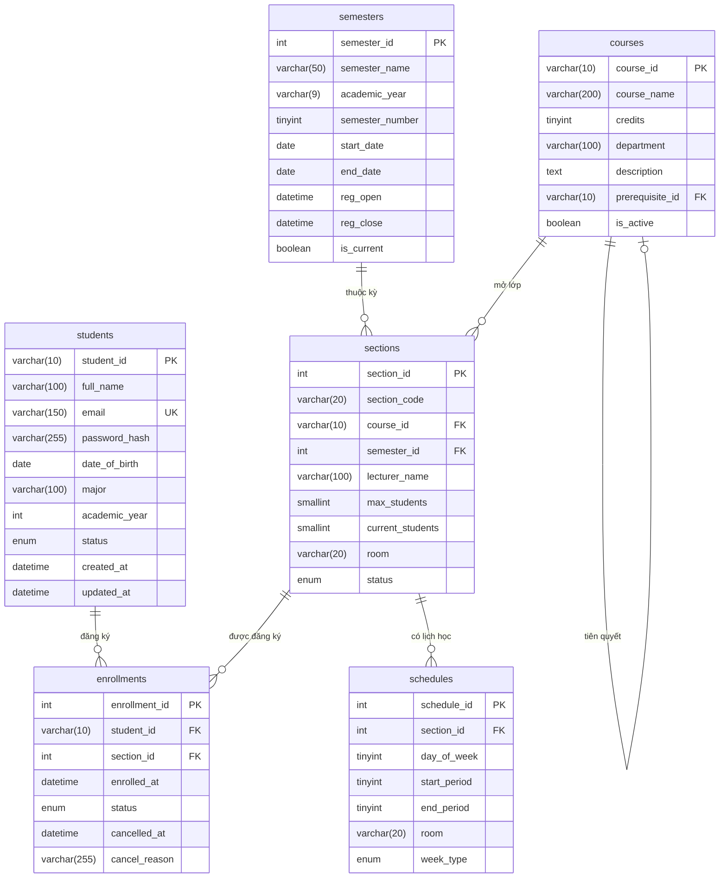

# Tài liệu Cơ sở dữ liệu - Hệ thống Quản lý và Đăng ký Học phần

Phiên bản: 1.0  
Ngày cập nhật: 23/03/2026  
Hệ quản trị cơ sở dữ liệu: MySQL 8.0+ / MariaDB 10.6+  
Bộ mã ký tự: utf8mb4 | Đối sánh: utf8mb4_unicode_ci

---

## Mục lục

1. [Tổng quan](#1-tổng-quan)
2. [Sơ đồ ERD](#2-sơ-đồ-erd)
3. [Chi tiết các bảng dữ liệu](#3-chi-tiết-các-bảng-dữ liệu)
4. [Quan hệ và Khóa ngoại](#4-quan-hệ-và-khóa-ngoại)
5. [Chỉ mục (Indexes)](#5-chỉ-mục-indexes)
6. [Quy tắc nghiệp vụ và Ràng buộc](#6-quy-tắc-nghiệp-vụ-và-ràng-buộc)
7. [Hướng dẫn triển khai di cư (Migration)](#7-hướng-dẫn-triển-khai-di-cư-migration)
8. [Dữ liệu mẫu khởi tạo](#8-dữ-liệu-mẫu-khởi-tạo)

---

## 1. Tổng quan

Hệ thống được thiết kế với 6 bảng chính trong cơ sở dữ liệu quan hệ:

| STT | Tên bảng | Mô tả | Số lượng cột |
|-----|----------|-------|--------------|
| 1 | students | Lưu trữ thông tin sinh viên và tài khoản người dùng | 10 |
| 2 | courses | Danh mục các môn học trong chương trình đào tạo | 7 |
| 3 | semesters | Thông tin về các học kỳ và thời gian đăng ký | 9 |
| 4 | sections | Các lớp học phần cụ thể được mở theo kỳ | 9 |
| 5 | schedules | Thời khóa biểu chi tiết cho từng lớp học phần | 7 |
| 6 | enrollments | Thông tin đăng ký học phần của sinh viên | 7 |

---

## 2. Sơ đồ ERD

---

## 3. Chi tiết các bảng dữ liệu

### 3.1 Bảng students - Thông tin sinh viên

Bảng này lưu trữ thông tin cá nhân và dữ liệu đăng nhập của sinh viên.

| Tên cột | Kiểu dữ liệu | Loại khóa | Bắt buộc | Mặc định | Mô tả |
|---------|--------------|-----------|----------|----------|-------|
| student_id | VARCHAR(10) | Khóa chính | Có | - | Mã sinh viên |
| full_name | VARCHAR(100) | - | Có | - | Họ và tên đầy đủ |
| email | VARCHAR(150) | Duy nhất | Có | - | Địa chỉ email liên hệ |
| password_hash | VARCHAR(255) | - | Có | - | Mật khẩu đã được mã hóa theo Bcrypt |
| date_of_birth | DATE | - | Không | NULL | Ngày tháng năm sinh |
| major | VARCHAR(100) | - | Không | NULL | Chuyên ngành theo học |
| academic_year | INT | - | Không | NULL | Niên khóa nhập học |
| status | ENUM | - | Có | 'active' | Trạng thái: active, suspended, graduated |
| created_at | DATETIME | - | Có | CURRENT_TIMESTAMP | Thời điểm khởi tạo tài khoản |
| updated_at | DATETIME | - | Có | CURRENT_TIMESTAMP | Thời điểm cập nhật cuối cùng |

Ghi chú bảo mật: Mật khẩu được mã hóa sử dụng thuật toán Bcrypt với salt rounds là 10. Email được ràng buộc duy nhất trên toàn hệ thống.

---

### 3.2 Bảng courses - Danh mục môn học

Thông tin về các môn học hiện có trong hệ thống giảng dạy.

| Tên cột | Kiểu dữ liệu | Loại khóa | Bắt buộc | Mặc định | Mô tả |
|---------|--------------|-----------|----------|----------|-------|
| course_id | VARCHAR(10) | Khóa chính | Có | - | Mã chính thức của môn học |
| course_name | VARCHAR(200) | - | Có | - | Tên gọi của môn học |
| credits | TINYINT | - | Có | - | Số đơn vị học trình (1-10) |
| department | VARCHAR(100) | - | Không | NULL | Khoa quản lý chuyên môn |
| description | TEXT | - | Không | NULL | Nội dung tóm tắt môn học |
| prerequisite_id | VARCHAR(10) | Khóa ngoại | Không | NULL | Mã môn học tiên quyết bắt buộc |
| is_active | BOOLEAN | - | Có | TRUE | Trạng thái hiển thị môn học |

Ghi chú: Cột prerequisite_id là khóa ngoại tự tham chiếu đến chính bảng courses.

---

### 3.3 Bảng semesters - Học kỳ

Quản lý thông tin thời gian theo từng giai đoạn học tập.

| Tên cột | Kiểu dữ liệu | Loại khóa | Bắt buộc | Mặc định | Mô tả |
|---------|--------------|-----------|----------|----------|-------|
| semester_id | INT | Khóa chính | Có | Tự tăng | Mã định danh học kỳ |
| semester_name | VARCHAR(50) | - | Có | - | Tên học kỳ (VD: HK1 2024-2025) |
| academic_year | VARCHAR(9) | - | Có | - | Niên khóa (VD: 2024-2025) |
| semester_number | TINYINT | - | Có | - | Thứ tự kỳ: 1, 2 hoặc 3 (Hè) |
| start_date | DATE | - | Có | - | Ngày bắt đầu học kỳ |
| end_date | DATE | - | Có | - | Ngày kết thúc học kỳ |
| reg_open | DATETIME | - | Có | - | Thời điểm bắt đầu cho phép đăng ký |
| reg_close | DATETIME | - | Có | - | Thời điểm đóng hệ thống đăng ký |
| is_current | BOOLEAN | - | Có | FALSE | Đánh dấu học kỳ hiện tại |

Quy tắc: Hệ thống chỉ cho phép duy nhất một học kỳ có trạng thái is_current là TRUE tại mọi thời điểm.

---

### 3.4 Bảng sections - Lớp học phần

Các lớp học phần cụ thể được triển khai dựa trên danh mục môn học trong từng kỳ.

| Tên cột | Kiểu dữ liệu | Loại khóa | Bắt buộc | Mặc định | Mô tả |
|---------|--------------|-----------|----------|----------|-------|
| section_id | INT | Khóa chính | Có | Tự tăng | Mã định danh lớp học phần |
| section_code | VARCHAR(20) | - | Có | - | Mã định danh lớp (VD: IT3001.01) |
| course_id | VARCHAR(10) | Khóa ngoại | Có | - | Tham chiếu đến bảng môn học |
| semester_id | INT | Khóa ngoại | Có | - | Tham chiếu đến bảng học kỳ |
| lecturer_name | VARCHAR(100) | - | Không | NULL | Tên giảng viên phụ trách lớp |
| max_students | SMALLINT | - | Có | - | Giới hạn số lượng sinh viên tối đa |
| current_students | SMALLINT | - | Có | 0 | Số lượng sinh viên đã đăng ký thành công |
| room | VARCHAR(20) | - | Không | NULL | Địa điểm phòng học dự kiến |
| status | ENUM | - | Có | 'open' | Trạng thái: open, closed, cancelled |

---

### 3.5 Bảng schedules - Thời khóa biểu

Chi tiết về lịch học của từng buổi trong tuần cho mỗi lớp học phần.

| Tên cột | Kiểu dữ liệu | Loại khóa | Bắt buộc | Mặc định | Mô tả |
|---------|--------------|-----------|----------|----------|-------|
| schedule_id | INT | Khóa chính | Có | Tự tăng | Mã định danh bản ghi lịch học |
| section_id | INT | Khóa ngoại | Có | - | Thuộc lớp học phần cụ thể |
| day_of_week | TINYINT | - | Có | - | Thứ mấy trong tuần (2 đến 8) |
| start_period | TINYINT | - | Có | - | Tiết học bắt đầu (1-12) |
| end_period | TINYINT | - | Có | - | Tiết học kết thúc (1-12) |
| room | VARCHAR(20) | - | Không | NULL | Phòng học cụ thể cho buổi đó |
| week_type | ENUM | - | Có | 'all' | Tần suất: all, odd (lẻ), even (chẵn) |

---

### 3.6 Bảng enrollments - Đăng ký học phần

Ghi nhận các yêu cầu đăng ký học phần chính thức của sinh viên.

| Tên cột | Kiểu dữ liệu | Loại khóa | Bắt buộc | Mặc định | Mô tả |
|---------|--------------|-----------|----------|----------|-------|
| enrollment_id | INT | Khóa chính | Có | Tự tăng | Mã định danh lượt đăng ký |
| student_id | VARCHAR(10) | Khóa ngoại | Có | - | Mã sinh viên thực hiện đăng ký |
| section_id | INT | Khóa ngoại | Có | - | Mã lớp học phần được chọn |
| enrolled_at | DATETIME | - | Có | CURRENT_TIMESTAMP | Thời gian ghi nhận đăng ký |
| status | ENUM | - | Có | 'enrolled' | Trạng thái: enrolled, cancelled... |
| cancelled_at | DATETIME | - | Không | NULL | Thời điểm xác nhận hủy đăng ký |
| cancel_reason | VARCHAR(255) | - | Không | NULL | Lý do sinh viên thực hiện hủy |

Quy tắc: Cặp giá trị student_id và section_id được ràng buộc duy nhất nhằm tránh đăng ký lặp lại.

---

## 4. Quan hệ và Khóa ngoại

Bảng dưới đây liệt kê các tham chiếu giữa các thực thể:

| Bảng con | Cột nguồn | Bảng cha | Cột đích | Hành động khi xóa |
|----------|-----------|----------|----------|-------------------|
| courses | prerequisite_id | courses | course_id | SET NULL |
| sections | course_id | courses | course_id | RESTRICT |
| sections | semester_id | semesters | semester_id | RESTRICT |
| schedules | section_id | sections | section_id | CASCADE |
| enrollments| student_id | students | student_id | RESTRICT |
| enrollments| section_id | sections | section_id | RESTRICT |

---

## 5. Chỉ mục (Indexes)

Hệ thống sử dụng các chỉ mục sau để tối ưu hóa hiệu năng truy vấn:

- uq_students_email: Đảm bảo tính duy nhất của địa chỉ email.
- idx_students_status: Tăng tốc độ lọc sinh viên theo tình trạng học tập.
- idx_semesters_current: Truy xuất nhanh chóng thông tin học kỳ hiện hành.
- idx_sections_semester_course: Hỗ trợ tìm kiếm nhanh các lớp mở theo kỳ và môn.
- uq_student_section: Ngăn chặn việc tạo ra các bản ghi đăng ký dư thừa.

---

## 6. Quy tắc nghiệp vụ và Ràng buộc

### 6.1 Quy trình kiểm tra khi đăng ký

1. Kiểm tra trạng thái sinh viên: Tài khoản phải ở trạng thái hoạt động (active).
2. Kiểm tra trạng thái lớp: Lớp học phần phải còn chỗ trống và đang ở trạng thái mở (open).
3. Kiểm tra thời gian: Yêu cầu phải được gởi đi trong khung giờ đăng ký của học kỳ tương ứng.
4. Kiểm tra lịch học: Sinh viên không được phép đăng ký hai lớp có thời gian học bị chồng lấn nhau.
5. Kiểm tra trùng lặp: Sinh viên không thể đăng ký lại một lớp đã đăng ký thành công trước đó.

### 6.2 Xử lý xung đột lịch học

Hai lịch học được coi là trùng nhau nếu:
- Diễn ra trong cùng một ngày thứ trong tuần.
- Có khoảng tiết học giao nhau.
- Có tính chất tuần học trùng nhau (Ví dụ: Một lịch học tất cả các tuần sẽ trùng với lịch học tuần lẻ hoặc tuần chẵn tại cùng thời điểm).

---

## 7. Hướng dẫn triển khai di cư (Migration)

Các bước thiết lập cấu trúc cơ sở dữ liệu:

1. Đảm bảo dịch vụ MySQL đang hoạt động.
2. Tạo cơ sở dữ liệu rỗng với bộ mã utf8mb4.
3. Chạy file script SQL chính thức: migrations/init.sql.
4. Hoặc thực thi lệnh npm run migrate từ giao diện dòng lệnh của máy chủ.

---

## 8. Dữ liệu mẫu khởi tạo

Sau khi thiết lập cấu trúc, nên chạy lệnh npm run seed để tạo các dữ liệu cơ sở phục vụ mục đích kiểm thử phần mềm. Dữ liệu này bao gồm danh sách sinh viên mẫu, các môn học đa dạng, và các học kỳ với các khung giờ đăng ký khác nhau.
